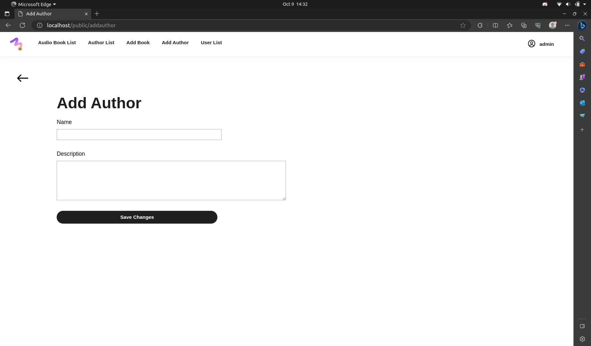
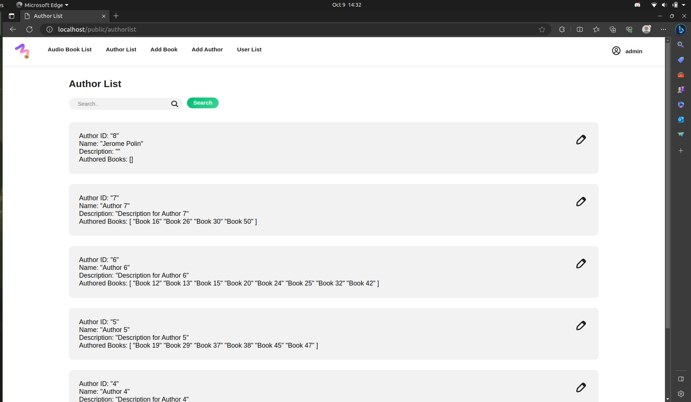
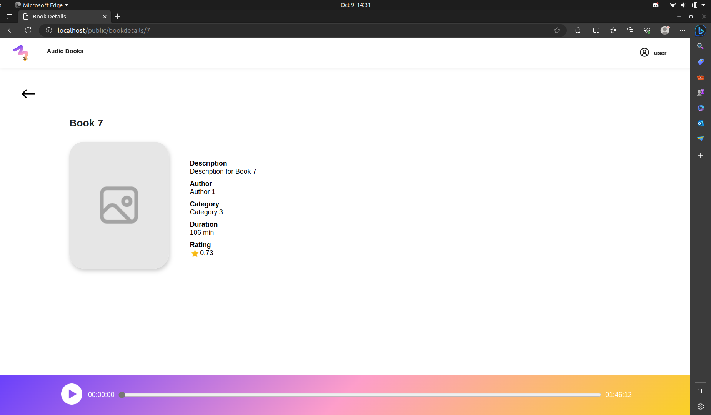
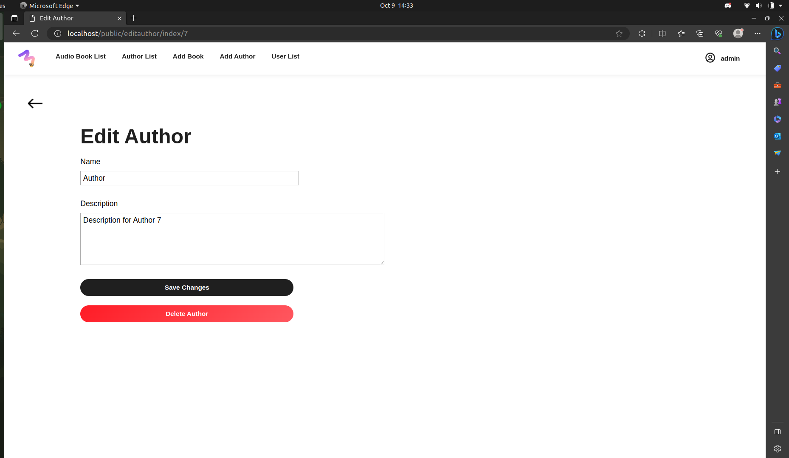
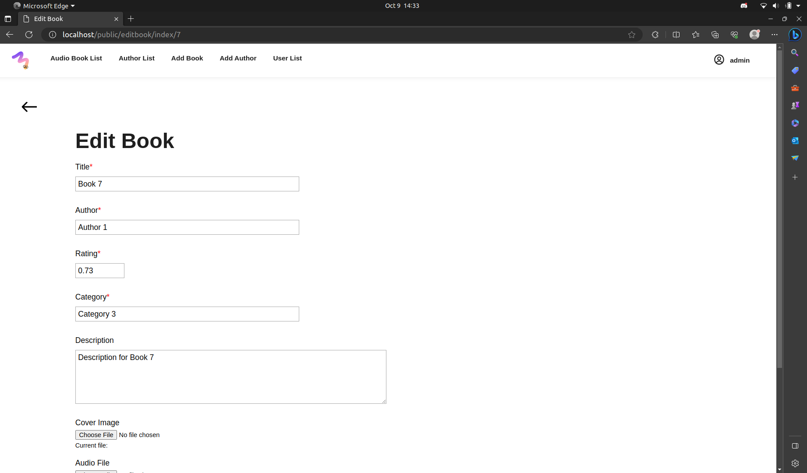
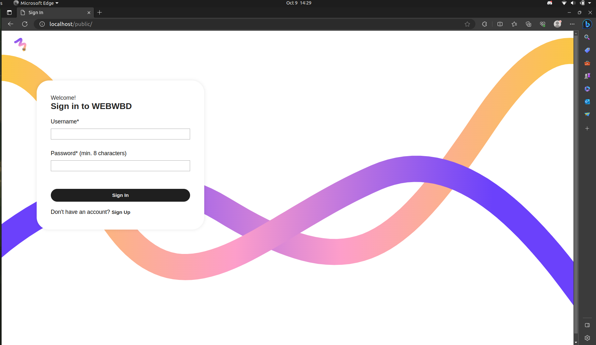
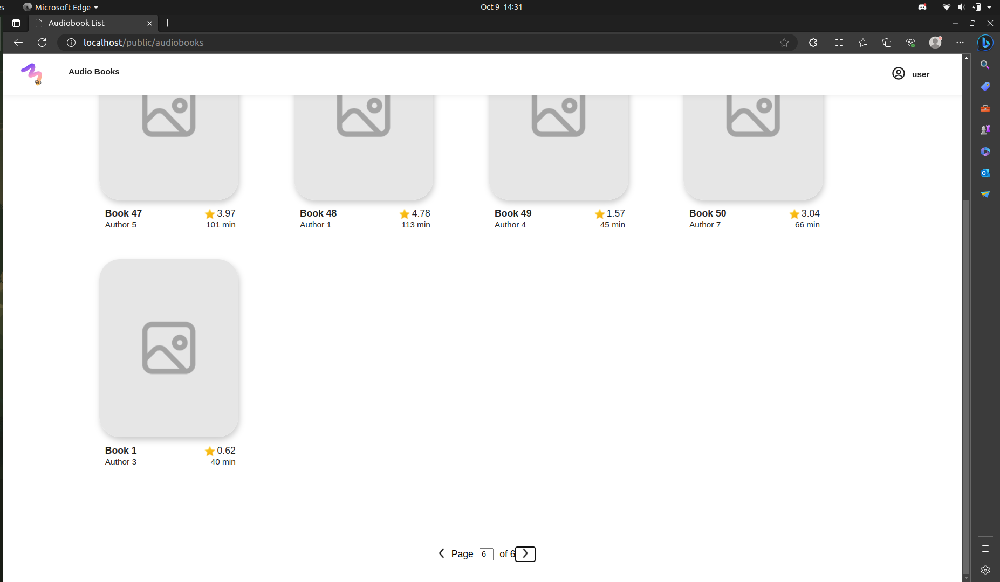
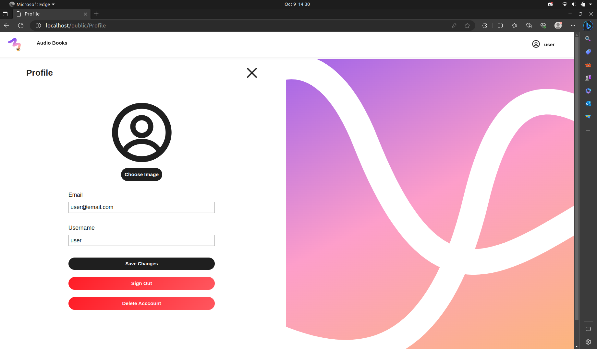
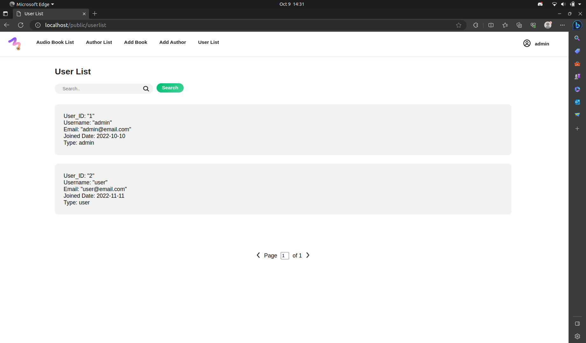

# WEBWBD

> Disusun untuk memenuhi Tugas Milestone 1 - Monolithic PHP & Vanilla Web Application IF3110 Pengembangan Aplikasi Berbasis Web

## Daftar Isi

- [Deskripsi Aplikasi _WEB_](#deskripsi-aplikasi-web)
- [Daftar _Requirement_](#daftar-requirement)
- [Cara Instalasi](#cara-instalasi)
- [Cara Menjalankan _Server_](#cara-menjalankan-server)
- [Screenshot Tampilan Aplikasi](#screenshot-tampilan-aplikasi)
- [Pembagian Tugas](#pembagian-tugas)

## Deskripsi Aplikasi _WEB_

**WEBWBD** merupakan sebuah web perpustakaan audio book sederhana. Pengguna dapat mendengarkan audio book dari berbagai penulis dengan mudah di web ini. Web ini dibuat menggunakan Vanilla PHP, HTML, CSS, dan JS. Web menggunakan Apache web server untuk dijalankan dan basisdata yang dihosting pada postgresql.

## Daftar _Requirement_

1. Docker

## Cara Instalasi

1. Clone repository ini dengan command `git clone https://gitlab.informatika.org/if3110-2023-01-31/tugas-besar-1.git`

## Cara Menjalankan _Server_

1. Buka terminal pada root directory repository
2. Pindah ke directory src dengan cara `cd src`
3. Beri permission shell script run.sh dengan command `sudo chmod 777 run.sh`
4. Pindah kembali ke root directory repository dengan command `cd ..`
2. Bila belum memiliki docker image, maka build dengan perintah `docker build -t tubes-1:latest .`
3. Bila belum terdapat file `.env` pada directory, maka buatlah file `.env` yang sesuai dengan file `.env.example`
4. Jalankan docker container dengan perintah `docker compose up`
5. Aplikasi web dapat diakses pada URL `https://localhost/public/`
6. Jalankan perintah `docker compose down` bila ingin menghentikan container docker.

## Screenshot Tampilan Aplikasi

### Add Author

### Add Book

### Audiobook List Admin

### Audiobook List User

### Author List

### Book Details

### Edit Author

### Edit Book

### Login

### Pagination Example in Audiobook List

### Profile

### User List

## Pembagian Tugas

### _Client Side_

- Add Author: 13521088, 13521144, 13521157
- Add Book: 13521088, 13521144, 13521157
- Admin Books List: 13521088, 13521144, 13521157
- Admin Authors List: 13521088, 13521144, 13521157
- Admin Users List: 13521088, 13521144, 13521157
- Audio Books List: 13521088, 13521144, 13521157
- Book Details: 113521088, 13521144, 13521157
- Edit Author: 13521088, 13521144, 13521157
- Edit Book: 13521088, 13521144, 13521157
- Forbidden: 13521088, 13521144, 13521157
- Not Found: 13521088, 13521144, 13521157
- Profile: 13521088, 13521144, 13521157
- Sign In: 13521088, 13521144, 13521157
- Sign Up: 13521088, 13521144, 13521157

### _Server Side_

- Add Author: 13521088, 13521144, 13521157
- Add Book: 13521088, 13521144, 13521157
- Admin Books List: 13521088, 13521144, 13521157
- Admin Authors List: 13521088, 13521144, 13521157
- Admin Users List: 13521088, 13521144, 13521157
- Audio Books List: 13521088, 13521144, 13521157
- Book Details: 13521088, 13521144, 13521157
- Edit Author: 13521088, 13521144, 13521157
- Edit Book: 13521088, 13521144, 13521157
- Forbidden: - (tidak ada request ke server)
- Not Found: - (tidak ada request ke server)
- Profile: 13521088, 13521144, 13521157
- Sign In: 13521088, 13521144, 13521157
- Sign Up: 13521088, 13521144, 13521157
